# IA626_Final_Project
# COVID-19 Data ETL and API Project

## Introduction

The COVID-19 pandemic has necessitated the availability of reliable and accessible data to facilitate timely decision-making and public health responses. This project leverages data from Johns Hopkins University to build a comprehensive system that not only processes and cleans COVID-19 data but also makes it accessible through a RESTful API interface. The interface allows for both detailed data manipulation and retrieval, serving a wide range of users including researchers, public health officials, and the general public interested in data-driven insights.


## Problem Statement

### Detailed Explanation of the Problem

The COVID-19 pandemic has posed an unprecedented global challenge, necessitating robust data collection and analysis to inform public health decisions and policymaking. Managing the pandemic effectively requires tracking the spread of the virus, the number of recoveries, and fatalities across different geographies over time. However, the sheer volume of data generated daily presents significant challenges in terms of data consistency, accessibility, and usability. Public health officials, researchers, and policymakers need access to reliable, clean, and easily accessible datasets to make informed decisions swiftly.

### How the Solution Might Be Utilized in a Real-World Scenario

This project provides a comprehensive solution by automating the ETL (Extract, Transform, Load) process for COVID-19 data, thereby ensuring that the data is consistently clean and structured for analysis. The Flask API facilitates easy access and manipulation of this data, supporting various operations such as data insertion, updates, and retrieval in a format that is ready for analytical tools and decision-making processes.

### Real-World Applications Include:

- **Public Health Monitoring**: The system can be used by health departments to monitor the spread of the virus in real-time, aiding in rapid decision-making regarding lockdowns, healthcare provisioning, and resource allocation.
- **Epidemiological Research**: Researchers can use the cleaned and structured datasets for epidemiological studies, enhancing understanding of the disease's dynamics and the effectiveness of various interventions.
- **Policy Formulation and Evaluation**: Policymakers can utilize the outputs of the system to formulate strategies based on current data trends and to evaluate the impact of previous policies, adjusting them as necessary to better manage the public health crisis.

By integrating data management and API services, this solution bridges the gap between raw data and actionable insights, serving as a crucial tool in the ongoing global effort to combat COVID-19. The system's adaptability also means it could be repurposed for future epidemiological challenges, proving its long-term utility beyond the current pandemic.


## Project Structure and Data Handling

### Data Sources

The project uses three primary datasets provided by Johns Hopkins University, encompassing confirmed cases, deaths, and recoveries from COVID-19. These datasets are comprehensive, containing daily updates of cases across different regions and countries. Given the vast amount of data and its varying quality, an ETL (Extract, Transform, Load) process is crucial to ensure the data is usable for analysis and application.

**Confirmed Cases**: Tracks the cumulative number of confirmed COVID-19 cases worldwide.
**Deaths**: Records the cumulative number of deaths due to COVID-19.
**Recovered Cases**: Notes the cumulative number of individuals who have recovered from COVID-19.


### Data Extraction and Transformation

1. **Extraction**: Data is extracted from daily updated CSV files.
2. **Transformation**: This stage involves:
   - **Cleaning**: Removal of extraneous columns like 'Province/State' and geographical coordinates.
   - **Aggregation**: Data is aggregated at the national level to provide a clear perspective on each country's situation.
   - **Date Selection**: Filtering out data to focus only on relevant dates to streamline the datasets.
3. **Loading**: The transformed data is loaded into new CSV files and then into the project's MySQL database managed via phpMyAdmin.

## Database Integration and API Functionality

The project employs MySQL, accessed through phpMyAdmin, to manage the database. This setup facilitates a structured storage solution where data integrity and security are maintained. The integration with MySQL allows for efficient data manipulation and retrieval, which is essential for the dynamic nature of the data being handled.

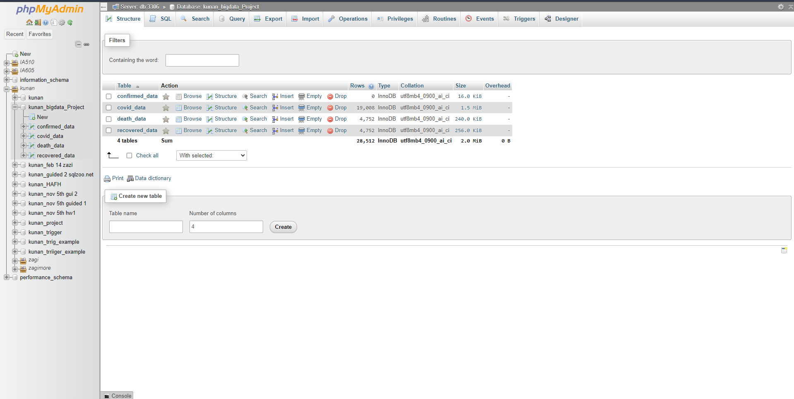

### API Development

Utilizing Flask, a Python web framework, the project delivers a series of RESTful APIs that enable extensive data interaction, including CRUD (Create, Read, Update, Delete) operations and complex queries, thereby addressing various user needs. Flask's lightweight and modular design makes it an ideal choice for building web applications that require a clean, simple interface for performing database interactions.

### Key Features of Flask in the Project

1. **Simplicity and Flexibility**
   Flask provides the tools needed to build APIs quickly and with minimal boilerplate code, which enhances development speed and allows for easy customization and extension of API services.

2. **Development Speed**
   With Flask, developers can leverage Python's extensive libraries and tools to expedite the development of robust web services. This includes integrations with databases, form handling, and more, crucial for a data-driven project like this.

3. **Scalability**
   While Flask is lightweight, it is highly scalable, making it suitable for handling both small local datasets and large-scale production data flows. Flask applications can be easily scaled up to meet increased demand as the user base grows or as data complexity increases.

4. **RESTful Request Handling**
   Flask supports the creation of RESTful requests, which are essential for web services that interact with a database. This allows the APIs to handle various HTTP requests (GET, POST, PUT, DELETE) efficiently, aligning with the CRUD operations required for the project.

5. **Community and Support**
   Flask is supported by a large community of developers and has a vast ecosystem of extensions that can be leveraged to add additional functionality such as user authentication, open authorization (OAuth), and more.

6. **Integration with Other Python Libraries**
   The project benefits significantly from Flask’s compatibility with other Python libraries. For example, Flask can be seamlessly integrated with Pandas for data manipulation, NumPy for numerical operations, and SQL Alchemy for database ORM (Object-Relational Mapping), which collectively enhance the project's data processing capabilities.


## File Upload

The application provides robust endpoints for uploading and managing CSV data related to COVID-19, including confirmed cases, deaths, and recovered cases. Each endpoint corresponds to a specific data type and facilitates the storage of structured data into a MySQL database. This design allows for efficient data retrieval and manipulation to support various analytical needs. Additionally, the system is designed to accommodate modifications to the data, enabling users to adapt the stored data for similar analytical problems or to enhance their understanding of the dataset.

### 1. Upload Confirmed Cases Data
- **Endpoint:** `POST http://127.0.0.1:5000/upload/confirmed`
- **Functionality:** Allows users to upload a CSV file containing data on confirmed cases. The format of the CSV must align with the database schema for confirmed cases. This endpoint ensures that data is directly stored into the database, facilitating real-time data management and analytics.

### 2. Upload Death Data
- **Endpoint:** `POST http://127.0.0.1:5000/upload/death`
- **Functionality:** This endpoint is designed for the upload of death data, enabling the storage of this specific dataset into the corresponding database table. Similar to the confirmed cases, the CSV format should match the expected schema to ensure compatibility and data integrity.

### 3. Upload Recovered Cases Data
- **Endpoint:** `POST http://127.0.0.1:5000/upload/recovered`
- **Functionality:** Targets the uploading of data related to recovered cases. It functions analogously to the other upload endpoints but interacts with a different table specifically set up for recovered case data.

### Data Reusability and Adaptability
The system not only allows for the initial upload and storage of data but also supports the dynamic use of this data for further analysis. Users can perform ETL processes to cleanse, reformat, or enrich the data according to their specific analytical needs. This capability is crucial for adapting the data to solve similar problems or for deriving deeper insights into the COVID-19 pandemic's trends and effects.

For example, a researcher could use the uploaded data to model disease spread patterns or to compare the efficacy of intervention strategies across different regions. By enabling easy access to modify and re-query the stored data, the application supports a broad range of analytical and research activities, enhancing both the utility and the educational value of the data.

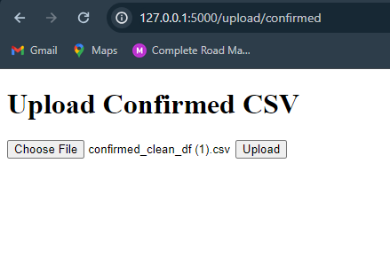

## 3. RESTful API Endpoints for Data Manipulation

### 1. Create Data
- **Endpoint:** `/api/data`
- **Method:** `POST`
- **Description:** Inserts a new record into the COVID-19 database.
- **Body:** JSON object representing the data record.
  ```json
  {
    "country": "CountryName",
    "date": "YYYY-MM-DD",
    "accumulated_confirmed": 100,
    "accumulated_deaths": 10,
    "accumulated_recovered": 90
  }
  ```

**Example cURL Request:**
```bash
curl -X POST http://127.0.0.1:5000/api/data -H "Content-Type: application/json" -d '{"country":"CountryName","date":"YYYY-MM-DD","accumulated_confirmed":100,"accumulated_deaths":10,"accumulated_recovered":90}'
```

### 2. Get Data by ID
- **Endpoint:** `/api/data/<int:data_id>`
- **Method:** `GET`
- **Description:** Fetches a specific record by its ID.

**Example cURL Request:**
```bash
curl http://127.0.0.1:5000/api/data/1
```

### 3. Update Data by ID
- **Endpoint:** `/api/data/<int:data_id>`
- **Method:** `PUT`
- **Description:** Updates an existing record identified by its ID.
- **Body:** JSON object with fields to update.
  ```json
  {
    "country": "UpdatedCountry",
    "date": "YYYY-MM-DD",
    "accumulated_confirmed": 150,
    "accumulated_deaths": 20,
    "accumulated_recovered": 130
  }
  ```

**Example cURL Request:**
```bash
curl -X PUT http://127.0.0.1:5000/api/data/1 -H "Content-Type: application/json" -d '{"country":"UpdatedCountry","date":"YYYY-MM-DD","accumulated_confirmed":150,"accumulated_deaths":20,"accumulated_recovered":130}'
```

### 4. Delete Data by ID
- **Endpoint:** `/api/data/<int:data_id>`
- **Method:** `DELETE`
- **Description:** Deletes a specific record by its ID.

**Example cURL Request:**
```bash
curl -X DELETE http://127.0.0.1:5000/api/data/1
```

#### Queries Output

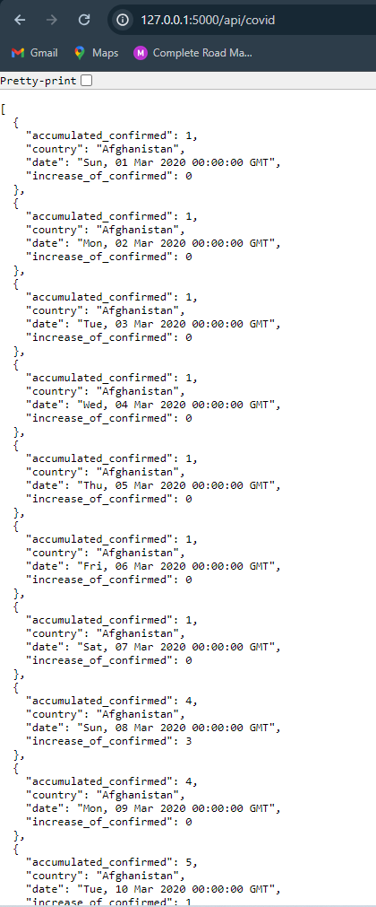
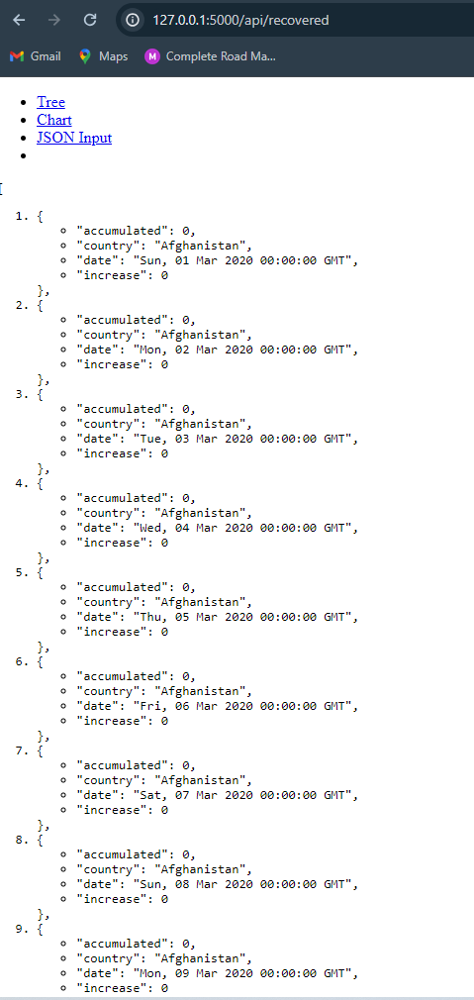
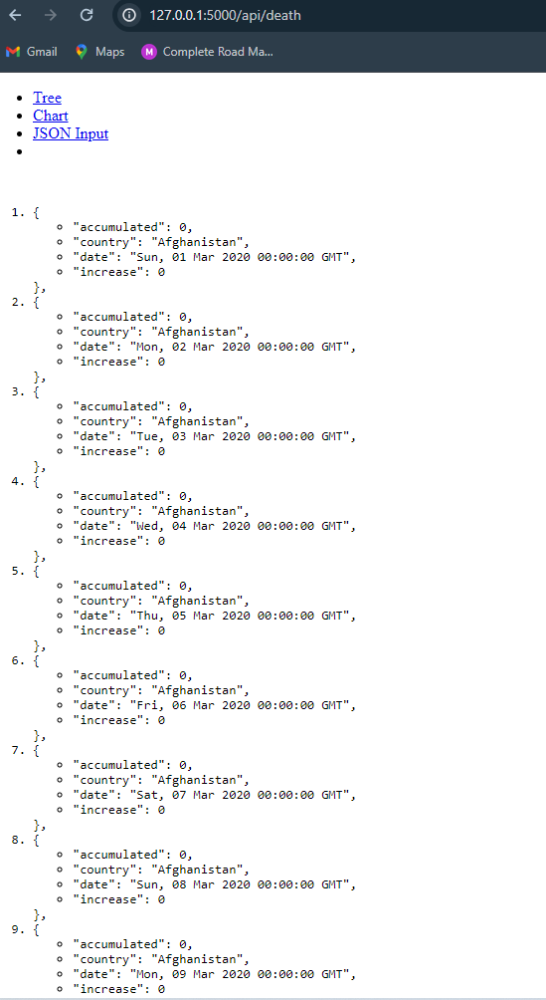

### 5. Get Country-Specific Data
- **Endpoint:** `/api/stats`
- **Method:** `GET`
- **Description:** Retrieves aggregated data for a specific country within a given date range.
- **Parameters:**
  - `country`: Name of the country.
  - `start_date`: Start date of the range (`YYYY-MM-DD`).
  - `end_date`: End date of the range (`YYYY-MM-DD`).

**Example cURL Request:**
```bash
curl "http://127.0.0.1:5000/api/stats?country=Afghanistan&start_date=2020-03-01&end_date=2020-03-12
```
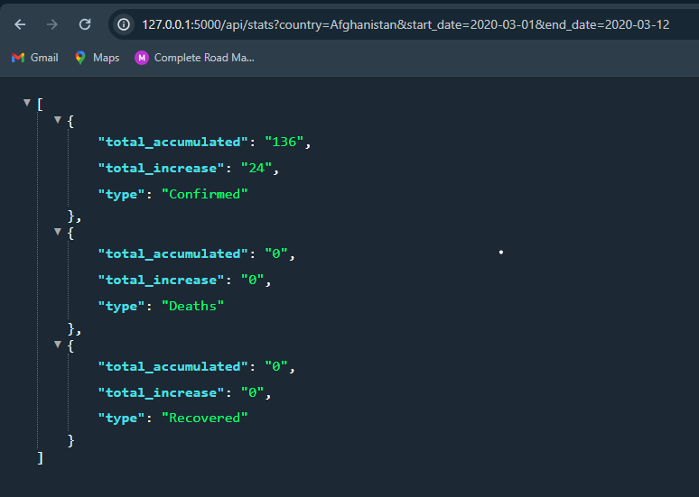

## 6. Get Data Range
**Endpoint**: `/api/data/range`
**Method**: GET
**Description**: Retrieves COVID-19 data across specified date ranges for confirmed cases, deaths, and recovered cases. This endpoint allows for data retrieval for all countries or a specific country if provided.
**Parameters**:
- `start_date` (required): The start date for the data range, in YYYY-MM-DD format.
- `end_date` (required): The end date for the data range, in YYYY-MM-DD format.
- `country` (optional): The country to filter the data by. If omitted, data for all countries within the specified range will be returned.

**Example cURL Request**:

```bash
curl "http://127.0.0.1:5000/api/data/range?start_date=2020-03-01&end_date=2020-03-10"
```

**Success Response**:

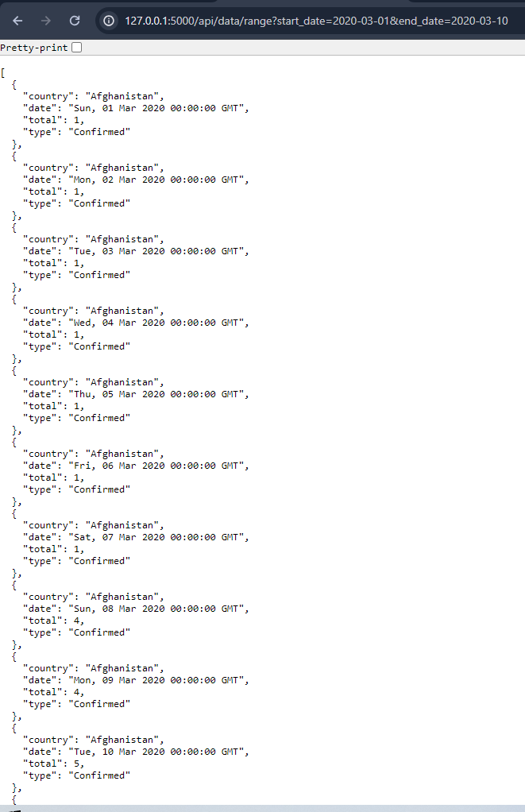
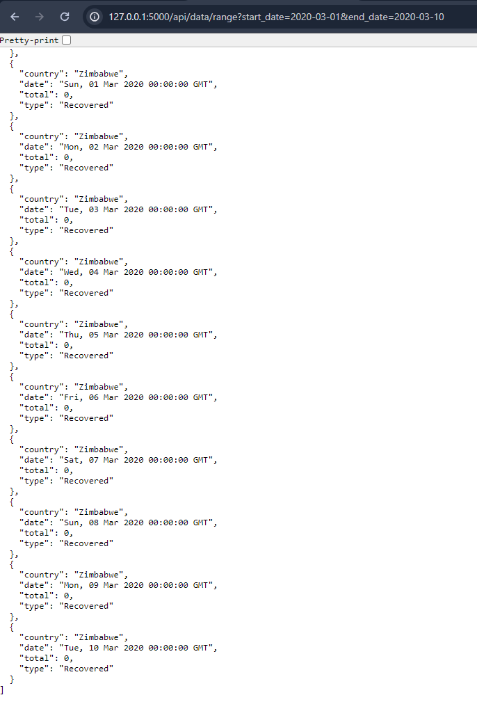

```bash
curl "http://127.0.0.1:5000/api/data/range?start_date=2020-03-01&end_date=2020-03-10&country=Afghanistan"
```
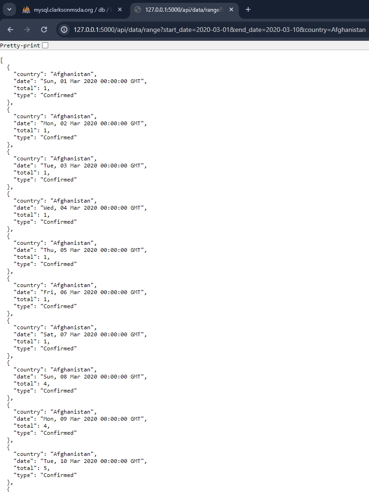
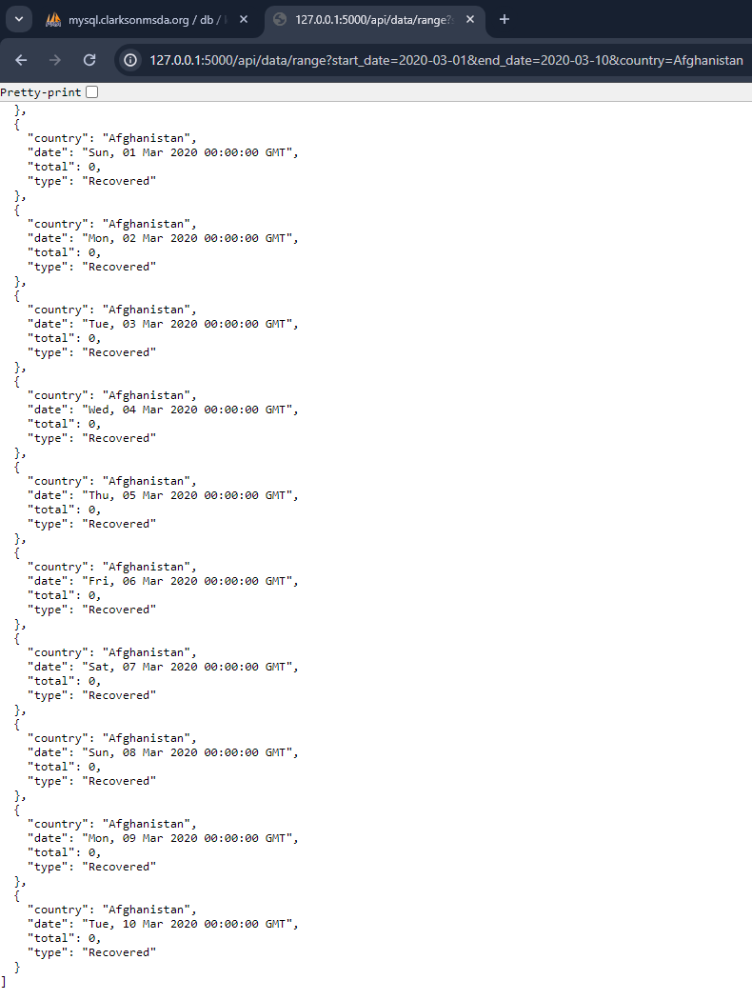
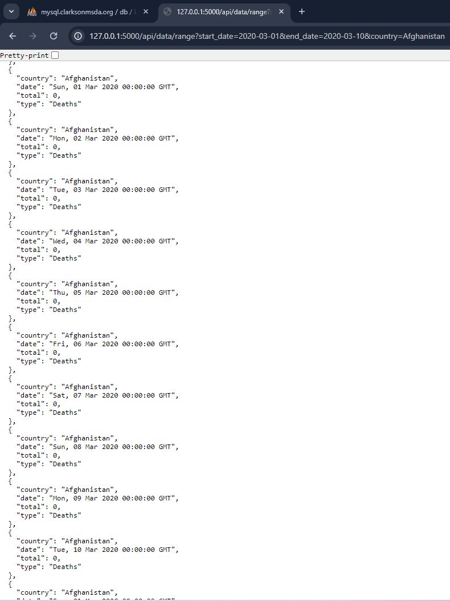


**Error Response**:

- **Condition**: If either `start_date` or `end_date` are missing.
- **Code**: 400 Bad Request
- **Content**:
  ```json
  {
      "description": "Start date and end date are required parameters."
  }
  ```


### 7. Get Total Counts
- **Endpoint:** `/api/total_counts`
- **Method:** `GET`
- **Description:** Provides total accumulated confirmed cases, deaths, and recoveries across all records.

**Example cURL Request:**
```bash
curl http://127.0.0.1:5000/api/total_counts
```
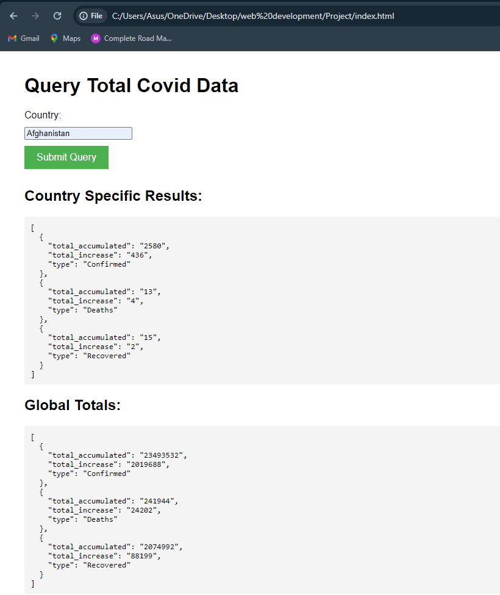

# Interface 

## Covid Data Query - Total Stats

This HTML page allows users to query total Covid data both globally and for specific countries. It includes form inputs and buttons for user interaction, and dynamically displays the query results.

### Features

- **Country Query Form:** Users can enter the name of a country to fetch Covid data for that specific country. The form will validate input and ensure the country name is provided before submitting a query.
- **Results Display:** The page displays country-specific results and global totals in separate sections. If no data is fetched or in the case of an error, appropriate messages are shown.

### Implementation Details

#### HTML Structure

- The page contains a main heading (`<h1>`), followed by a form for entering the country name.
- There are placeholders (`<pre>`) to display the country-specific results and global totals.

#### CSS Styling

- The body of the page has a standard font and margin.
- Input fields and buttons have consistent styling with margins, and the button has a green background.

#### JavaScript Functionality

- The `fetchData` function is triggered when the submit button is clicked. It checks if the country input is not empty.
- The function makes asynchronous HTTP requests to the Flask backend to fetch data for both the specified country and global statistics.
- The results from these requests are displayed in the predefined placeholders.
- If any request fails, an error message is shown.

### Usage

To use this page, a user simply needs to:
1. Enter a country name in the input field.
2. Click the "Submit Query" button to fetch the data.
3. View the fetched data displayed under the "Country Specific Results" and "Global Totals" headings.

The script makes calls to the backend, assuming the server is running locally on `http://127.0.0.1:5000`. It fetches country-specific data and global totals using the provided API endpoints.

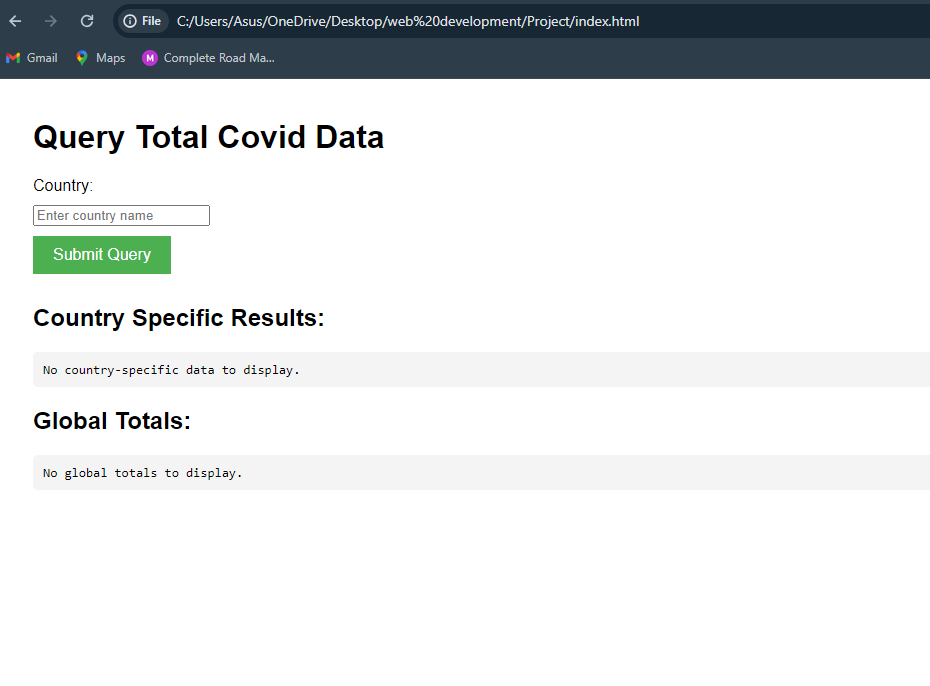

# API Testing Documentation

This document describes the automated tests for a Flask application API using Python's `unittest` framework and the `requests` library. These tests aim to ensure that the Flask API is functioning correctly, handling expected inputs properly, and responding with appropriate outputs.

## Why Automated Testing?

Automated testing is crucial for several reasons:
- **Reliability:** It ensures that the application behaves as expected after new changes or updates.
- **Efficiency:** It saves time compared to manual testing, especially for large applications.
- **Coverage:** It helps to systematically cover all aspects of the application, including edge cases that might be overlooked manually.
- **Regression Detection:** It helps in identifying if new changes have adversely affected existing functionality (regressions).

## Test Cases

The test suite covers various functionalities of the API, focusing on CRUD operations and specific behaviors expected from the API endpoints.

### Test Setup

```python
import unittest
import requests

class APITestCase(unittest.TestCase):
    BASE_URL = 'http://127.0.0.1:5000'
```

### Test Cases Explained

#### 1. Upload CSV Data

```python
def test_upload_csv(self):
    url = f'{self.BASE_URL}/upload/deaths'
    files = {'file': ('C:/Users/Asus/OneDrive/Desktop/web development/Project/deaths_clean_df.csv', open('deaths_clean_df.csv', 'rb'), 'text/csv')}
    response = requests.post(url, files=files)
    self.assertEqual(response.status_code, 302)
```
- **Purpose:** Tests the CSV file upload functionality for death data.
- **Expected Outcome:** The server should handle file uploads properly and return a HTTP 302 status code indicating a redirection, typically after successful upload.

#### 2. Create Data

```python
def test_create_data(self):
    url = f'{self.BASE_URL}/api/data'
    data = {
        'country': 'Afghanistan',
        'date': '2022-03-25',
        'accumulated_confirmed': 100,
        'accumulated_deaths': 5,
        'accumulated_recovered': 95
    }
    response = requests.post(url, json=data)
    self.assertEqual(response.status_code, 201)
```
- **Purpose:** Tests creating new data entries via the API.
- **Expected Outcome:** The API should accept the data and respond with a 201 status code, indicating that the data was successfully created.

#### 3. Read Data

```python
def test_read_data(self):
    data_id = 1
    url = f'{self.BASE_URL}/api/data/{data_id}'
    response = requests.get(url)
    self.assertEqual(response.status_code, 200)
    self.assertIn('country', response.json())
```
- **Purpose:** Verifies that the API can retrieve data by ID.
- **Expected Outcome:** The API should return the data for the given ID with a 200 status code, and the response should include key data fields like 'country'.

#### 4. Update Data

```python
def test_update_data(self):
    data_id = 1
    url = f'{self.BASE_URL}/api/data/{data_id}'
    data = {
        'accumulated_confirmed': 120,
        'accumulated_deaths': 10,
        'accumulated_recovered': 110
    }
    response = requests.put(url, json=data)
    self.assertEqual(response.status_code, 200)
```
- **Purpose:** Tests the ability to update existing data entries.
- **Expected Outcome:** Upon successful update, the API should return a 200 status code.

#### 5. Delete Data

```python
def test_delete_data(self):
    data_id = 2  # Assuming there's an entry with ID=2 for testing
    url = f'{self.BASE_URL}/api/data/{data_id}'
    response = requests.delete(url)
    self.assertEqual(response.status_code, 200)
```
- **Purpose:** Tests the deletion of data from the API.
- **Expected Outcome:** The API should successfully delete the specified data entry and return a 200 status code.

#### 6. Fetch Country-Specific Data

```python
def test_get_country_data(self):
    url = f'{self.BASE_URL}/api/stats?country=TestLand&start_date=2022-01-01&end_date=2022-12-31'
    response = requests.get(url)
    self.assertEqual(response.status_code, 200)
```
- **Purpose:** Tests retrieving data for a specific country over a defined date range.
- **Expected Outcome:** The API should return the requested data and a 200 status code if the query

 is valid.

#### 7. Fetch Global Totals

```python
def test_get_total_counts(self):
    url = f'{self.BASE_URL}/api/total_counts'
    response = requests.get(url)
    self.assertEqual(response.status_code, 200)
```
- **Purpose:** Tests the API's ability to provide aggregated global data.
- **Expected Outcome:** The API should return the aggregated data with a 200 status code.


## Conclusion

This project, through its sophisticated use of the Flask framework and a MySQL database, provides a robust platform for handling and analyzing COVID-19 data from Johns Hopkins University. The development and deployment of RESTful APIs facilitate comprehensive data interactions, ranging from simple data retrieval to complex data manipulation and aggregation.

### Achievements

- **Data Accessibility**: By automating the ETL process and providing RESTful APIs, the project ensures that accurate and up-to-date COVID-19 data is readily available to researchers, public health officials, and the general public.
- **Data Integrity and Security**: The use of MySQL for database management under the control of Flask ensures that data integrity and security are maintained, which is crucial for sensitive health data.
- **User Empowerment**: The APIs enable users to perform detailed analyses, generate reports, and derive insights that are critical for understanding and responding to the global pandemic. The ability to query, update, and manage the data dynamically empowers users to tailor the data to their specific needs.

### Impact

The project's impact extends beyond just data management to actively contributing to global health responses. By providing a transparent and accessible way to analyze pandemic trends, it supports informed decision-making that can lead to more effective intervention strategies and public health communications.


### Improvements
Suggestions on Enhancing the Model's Performance:
Integration of Additional Data Sources: Incorporate more granular data, such as age, gender, and comorbidities of cases, which could provide deeper insights into the virus's impact on different demographics.
Include mobility data to understand and predict the effects of travel on virus spread.
Feature Engineering: Develop new features from existing data, such as the rate of change in cases, recoveries, and deaths, which could help capture trends more effectively.
Implement natural language processing on news articles or social media data to gauge public sentiment and awareness, potentially using this as a predictive feature.
Advanced Analytical Techniques: Explore machine learning models that are inherently good at handling sequential data, such as LSTM (Long Short-Term Memory) networks or other advanced neural network architectures.
Utilize ensemble methods that combine the predictions of multiple models to improve accuracy and reliability.
Real-Time Data Processing: Shift from batch processing to real-time data streams to enable faster response times in data analysis and reporting, which is crucial during a pandemic.
Geospatial Analysis: Leverage geospatial analysis to visualize and predict the spread of the virus across different regions and to understand the effectiveness of regional lockdowns and restrictions.
Possibilities for Future Enhancements: Interactive Dashboards: Develop interactive dashboards that provide real-time visualizations of the data for more intuitive analysis by public health officials and policymakers.
Predictive Alerts System: Implement a predictive alert system that notifies health authorities about potential hotspots or surges in cases using predictive analytics.
Integration with Healthcare Systems: Integrate the system with healthcare providers' databases to get real-time updates on hospital capacities, ventilator availability, and other critical resources.
Adaptability to Other Health Crises: Design the system to be adaptable to other infectious diseases by allowing easy reconfiguration of the data inputs and analysis parameters.
By embracing these improvements, the COVID-19 data management system can not only become more robust and insightful but also serve as a scalable model for tackling future public health challenges. This proactive and enhanced approach ensures that the system remains relevant and continues to provide valuable insights in evolving scenarios.


### Final Thoughts

The successful implementation of this project demonstrates the power of technology in managing and mitigating the effects of global crises. As the project continues to evolve, it will undoubtedly play a crucial role in the ongoing efforts to understand and combat COVID-19. The flexibility and scalability of the platform ensure that it can adapt to the changing dynamics of the pandemic and continue to serve as a valuable resource for global health data.
